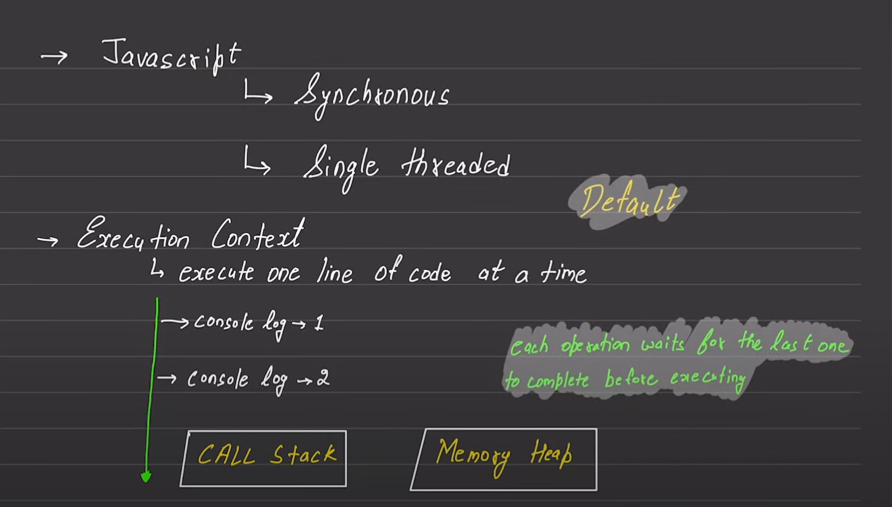
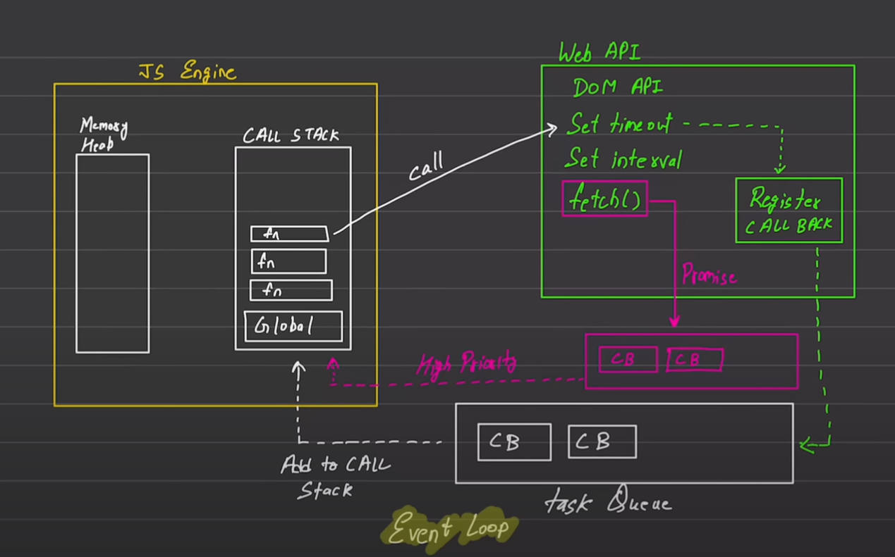

# Async Code

**Working of async code**



source: Chai aur Code YT Channel

## JavaScript Timers

#### 1. **`setTimeout()`**

- Executes a function or a block of code once after a specified delay (in milliseconds).

```javascript
const changeText = function () {
  document.querySelector("h1").innerHTML = "Best JS series"; // Changes the heading text
};
const changeMe = setTimeout(changeText, 2000); // Executes changeText after 2 seconds
```

#### 2. **`clearTimeout()`**

- Stops the execution of a function that was set to be executed using `setTimeout()`.

**Example**:

```javascript
document.querySelector("#stop").addEventListener("click", function () {
  clearTimeout(changeMe); // Stops the timeout if the button is clicked before 2 seconds
  console.log("Timeout stopped");
});
```

#### 3. **`setInterval()`**

- Repeatedly executes a function or block of code at specified intervals (in milliseconds).

```javascript
const sayDate = function () {
  console.log("Current time:", Date.now()); // Logs the current time every second
};
const intervalId = setInterval(sayDate, 1000); // Executes sayDate every second
```

#### 4. **`clearInterval()`**

- Stops the repeated execution of a function that was set up using `setInterval()`.

```javascript
document.querySelector("#stop").addEventListener("click", function () {
  clearInterval(intervalId); // Stops the interval when the button is clicked
  console.log("Interval stopped");
});
```


## Promises

#### **What is a Promise?**

A Promise in JavaScript is an object representing the eventual completion (or failure) of an asynchronous operation and its resulting value.

#### **Promise States**

A Promise can be in one of three states:

1. **Pending**: The initial state, meaning the operation is ongoing.
2. **Fulfilled**: The operation completed successfully, and the Promise is resolved with a value.
3. **Rejected**: The operation failed, and the Promise is rejected with a reason (error).

#### **Creating a Promise**

A Promise is created using the `Promise` constructor, which takes a function as an argument. This function is called the executor function, and it receives two arguments: `resolve` and `reject`.

- **`resolve(value)`**: Called when the asynchronous operation is successful. It passes the result to the next `.then()` method.
- **`reject(reason)`**: Called when the asynchronous operation fails. It passes the error to the `.catch()` method.

**Example**:

```javascript
const promise = new Promise((resolve, reject) => {
  // Perform an asynchronous operation
  setTimeout(() => {
    resolve("Success!");
  }, 1000);
});
```

#### **Consuming Promises**

Promises can be consumed using `.then()`, `.catch()`, and `.finally()` methods:

1. **`.then()`**: Handles the successful completion of the Promise.

   ```javascript
   promise.then((value) => {
     console.log(value); // "Success!"
   });
   ```

2. **`.catch()`**: Handles errors (rejections) in the Promise chain.

   ```javascript
   promise.catch((error) => {
     console.log(error);
   });
   ```

3. **`.finally()`**: Executes code after the Promise is settled, regardless of its outcome (fulfilled or rejected).
   ```javascript
   promise.finally(() => {
     console.log("Promise has been settled.");
   });
   ```

#### **Chaining Promises**

Imagine you're building an e-commerce website where users can order products. Here's a scenario where you might need to chain promises:

1. **Fetch Product Details:** Get the details of a product based on the product ID.
2. **Check Inventory:** Check if the product is available in the inventory.
3. **Place Order:** If the product is available, place the order.
4. **Send Confirmation:** Once the order is placed, send a confirmation email to the user.

Here's how you could implement this with chained promises:

```javascript
// Step 1: Fetch Product Details
function getProductDetails(productId) {
  return new Promise((resolve, reject) => {
    setTimeout(() => {
      console.log("Fetching product details...");
      resolve({ productId: productId, name: "Laptop", price: 1500 });
    }, 1000);
  });
}

// Step 2: Check Inventory
function checkInventory(product) {
  return new Promise((resolve, reject) => {
    setTimeout(() => {
      console.log("Checking inventory...");
      if (product.productId === 1) {
        resolve(product);
      } else {
        reject("Product out of stock");
      }
    }, 1000);
  });
}

// Step 3: Place Order
function placeOrder(product) {
  return new Promise((resolve, reject) => {
    setTimeout(() => {
      console.log("Placing order...");
      resolve({ orderId: 12345, product: product });
    }, 1000);
  });
}

// Step 4: Send Confirmation
function sendConfirmation(order) {
  return new Promise((resolve, reject) => {
    setTimeout(() => {
      console.log("Sending confirmation email...");
      resolve(`Confirmation email sent for order ID: ${order.orderId}`);
    }, 1000);
  });
}

// Chaining the promises
getProductDetails(1)
  .then((product) => checkInventory(product))
  .then((availableProduct) => placeOrder(availableProduct))
  .then((order) => sendConfirmation(order))
  .then((confirmation) => console.log(confirmation))
  .catch((error) => console.log(error));
```

**Explanation**:

1. **getProductDetails(1)**: Simulates fetching product details based on the product ID. It returns a promise that resolves with product information.

2. **checkInventory(product)**: Takes the product information and checks if it's available in the inventory. If available, it resolves with the product; otherwise, it rejects with an error.

3. **placeOrder(product)**: Takes the available product and simulates placing an order. It resolves with an order ID and the product details.

4. **sendConfirmation(order)**: Takes the order details and simulates sending a confirmation email. It resolves with a message indicating the confirmation email was sent.

5. **Chaining**: Each step depends on the previous step's result. If any step fails (e.g., the product is out of stock), the error is caught and handled in the `catch` block.

**Output:**

```
Fetching product details...
Checking inventory...
Placing order...
Sending confirmation email...
Confirmation email sent for order ID: 12345
```

#### Async/Await

`async` and `await` provide a more readable way to work with Promises:

- **`async` Function**: Declares a function that returns a Promise. Inside the function, you can use `await` to pause the execution until the Promise is resolved.
- **`await`**: Pauses the execution of the async function until the Promise is resolved or rejected.

**Example**:

```javascript
async function fetchData() {
  try {
    const response = await fetch("https://api.example.com/data");
    const data = await response.json();
    console.log(data);
  } catch (error) {
    console.log("Error:", error);
  }
}

fetchData();
```
