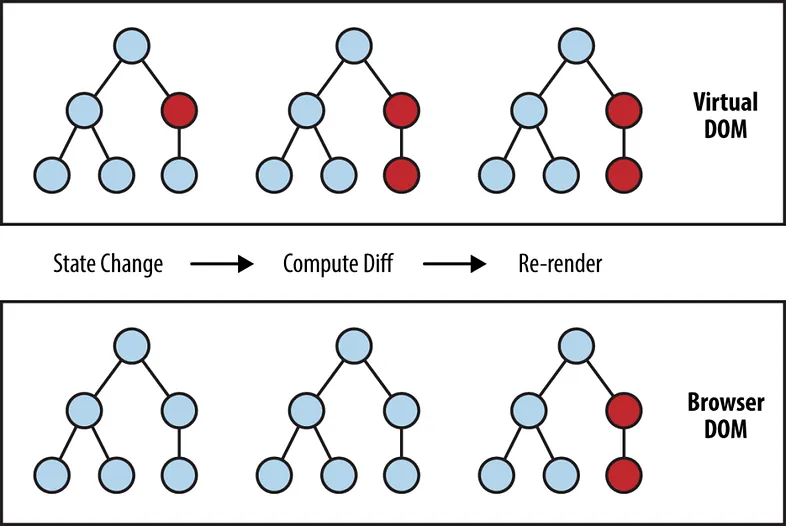

# State and Lifecycle

### State in React and the `useState` Hook

Components often need to change what’s on the screen as a result of an interaction. Typing into the form should update the input field, clicking “next” on an image carousel should change which image is displayed, clicking “buy” should put a product in the shopping cart. Components need to “remember” things: the current input value, the current image, the shopping cart. In React, this kind of component-specific memory is called state.

#### **Why Use State:**

```javascript
function Counter() {
  let count = 0; // Local variable

  const increment = () => {
    count += 1;
    console.log(count); // This will log the updated count, but...
  };

  return (
    <div>
      <p>Count: {count}</p> {/* This will always show 0 */}
      <button onClick={increment}>Increment</button>
    </div>
  );
}
```

The increment function is updating a local variable, count. But two things prevent that change from being visible:

- **Local variables don’t persist between renders.** Every time you click the "Increment" button, the increment function updates count, but since count is a local variable, it resets to 0 on each render. The displayed count remains 0 because React re-renders the component and reinitializes count.
- **Changes to local variables won’t trigger renders.** React only re-renders a component when there’s a change in its state or props. Changes to local variables do not trigger a re-render.

The `useState` Hook provides those two things:

- A state variable to retain the data between renders.
- A state setter function to update the variable and trigger React to render the component again.

#### **The `useState` Hook:**

- **Syntax**:
  ```javascript
  const [state, setState] = useState(initialValue);
  ```
  - `state`: The current state value.
  - `setState`: A function to update the state.
  - `initialValue`: The initial value of the state, which can be any data type.

**Counter with useState**

```jsx
import React, { useState } from "react";

function Counter() {
  const [count, setCount] = useState(0); // State variable with initial value 0

  const increment = () => {
    setCount((prevCount) => prevCount + 1); // Update state
  };

  return (
    <div>
      <p>Count: {count}</p> {/* This will display the updated count */}
      <button onClick={increment}>Increment</button>
    </div>
  );
}
```

### Virtual DOM, Fiber, and Reconciliation in React

#### **1. Virtual DOM:**

- The Virtual DOM is a lightweight, in-memory representation of the actual DOM (Document Object Model). React uses it to optimize updates to the real DOM.
- Instead of directly manipulating the DOM, React creates a virtual copy of it. When the state of a component changes, React updates the Virtual DOM first, and then determines the most efficient way to update the real DOM.

- The algorithm uses two main techniques to optimize updates:

  - **Tree diffing**: React compares the current virtual DOM tree with the updated virtual DOM tree, and identifies the minimum number of changes necessary to bring the virtual DOM in line with the updated state.

  - **Batching**: React batches multiple changes into a single update, reducing the number of updates to the virtual DOM and, in turn, the real DOM.

- **How It Works:**
  1. **Rendering**: React renders the UI to the Virtual DOM.
  2. **Diffing**: When state or props change, React compares the new Virtual DOM with the previous version (this process is called "diffing").
  3. **Reconciliation**: React determines the minimal number of changes needed to update the real DOM to match the new Virtual DOM.



#### **2. Reconciliation:**

- **What is Reconciliation?**

  - Reconciliation is the process by which React updates the DOM to match the current state of the application. It involves comparing the new Virtual DOM with the previous one and determining the most efficient way to update the real DOM.

- **How Reconciliation Works:**

  1. **Diffing**: React compares the new Virtual DOM tree with the previous one, node by node. This comparison is optimized using heuristics to minimize the number of changes.
  2. **Updating the Real DOM**: Based on the diffing process, React determines the minimal set of changes required to update the real DOM. These changes could involve adding, removing, or updating nodes.

- **Key Principles of Reconciliation:**

  - **Element Type**: If two elements have the same type, React assumes they represent the same DOM node, and it only updates the changed attributes.
  - **Keys**: React uses keys to identify elements in lists, which helps with efficient reordering and minimizing updates.

#### 3. React Fiber

React Fiber is a major reimplementation of the React core algorithm introduced in React 16. To understand Fiber and how it differs from the previous version, let's break it down in simple terms.

**i. React Before Fiber (Old Reconciliation Algorithm)**

Before Fiber, React used a reconciliation algorithm that operated in a synchronous, "all-or-nothing" manner. Here's how it worked:

- **Synchronous Rendering**: When React started rendering a component, it would render the entire component tree in one go, from top to bottom. If the tree was large or complex, this could take a while.
- **Blocking UI**: During this rendering process, the UI was blocked, meaning the browser couldn't do anything else (like responding to user input) until React finished rendering. This could lead to janky, unresponsive UIs, especially on slower devices.

**Example:**
Imagine you're updating a large list of items on a webpage. With the old algorithm, React would start rendering the updated list and wouldn't stop until it was done. If this took too long, the user might experience lag or unresponsiveness.

**ii. What is React Fiber?**

React Fiber is a complete rewrite of React’s reconciliation algorithm designed to address these issues. It introduces the concept of **incremental rendering**, allowing React to break down the rendering work into smaller chunks and spread it over multiple frames.

- **Incremental Rendering**: Fiber allows React to pause work, prioritize certain updates, and resume work later. This means React can handle more urgent tasks (like responding to user input) without waiting for the entire component tree to finish rendering.
- **Prioritization**: With Fiber, React can assign different priorities to different types of updates. For example, animations might be given a higher priority than data loading, ensuring a smooth user experience.
- **Time-Slicing**: React can break the rendering work into small units of work that fit within a frame. This prevents the UI from freezing because React can work on rendering in the background while still allowing the browser to handle user input.

**Example:**
Imagine you're updating the same large list of items. With React Fiber, React might render a few items, check if there's any urgent work to do (like handling a button click), and then continue rendering the list. The user won't experience any lag because React is handling updates in small, manageable chunks.

#### **iii. Key Differences: React Before and After Fiber**

| Feature                    | React Before Fiber (Old)                           | React Fiber (New)                             |
| -------------------------- | -------------------------------------------------- | --------------------------------------------- |
| **Rendering**              | Synchronous, blocking UI                           | Incremental, non-blocking UI                  |
| **Update Prioritization**  | No prioritization, all updates treated the same    | Updates can be prioritized (e.g., animations) |
| **Handling Large Updates** | Long tasks can block the main thread               | Time-slicing breaks tasks into smaller units  |
| **User Experience**        | Can be janky and unresponsive during heavy updates | Smoother, more responsive UI                  |

#### **iv. Real-World Example: A Search Bar**

- **Before Fiber:**
  Imagine a search bar that filters a large list of items. When the user types, React starts re-rendering the entire list based on the search input. If the list is large, this can cause noticeable lag, making the search bar feel slow.

- **With Fiber:**
  With Fiber, React can start rendering the filtered list in smaller chunks. While doing so, it can still handle other tasks, like processing additional keystrokes from the user. This results in a much smoother and responsive search experience.

#### **Key Takeaways:**

- **Virtual DOM**: A concept used by React to improve performance by minimizing direct DOM manipulations.
- **Fiber**: A new algorithm in React that improves responsiveness by breaking rendering work into small, interruptible units.
- **Reconciliation**: The process by which React updates the real DOM to match the current state of the Virtual DOM, ensuring minimal changes and efficient updates.

These concepts are fundamental to how React efficiently manages and updates the user interface, providing a smooth and responsive experience.

Youtube Video:

[A Cartoon Intro to Fiber - React Conf 2017](https://youtu.be/ZCuYPiUIONs?si=JoqnWC5nHc2V2g-D)

[React Fiber Deep Dive](https://youtu.be/0ympFIwQFJw?si=H_IRLKP_ZuH6l5zO)
